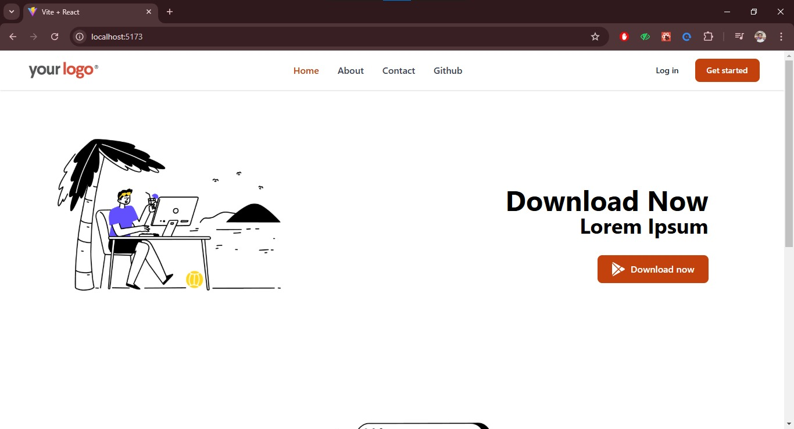
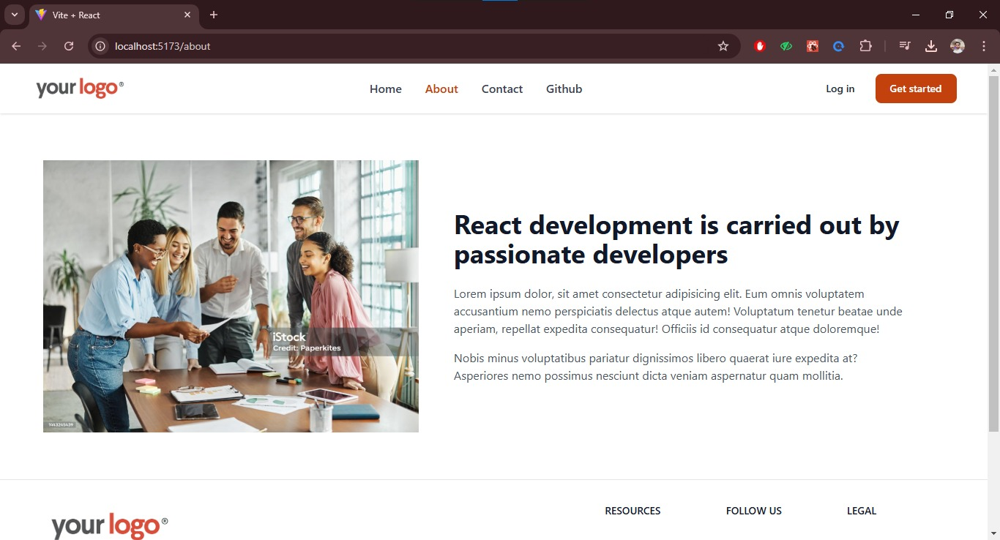
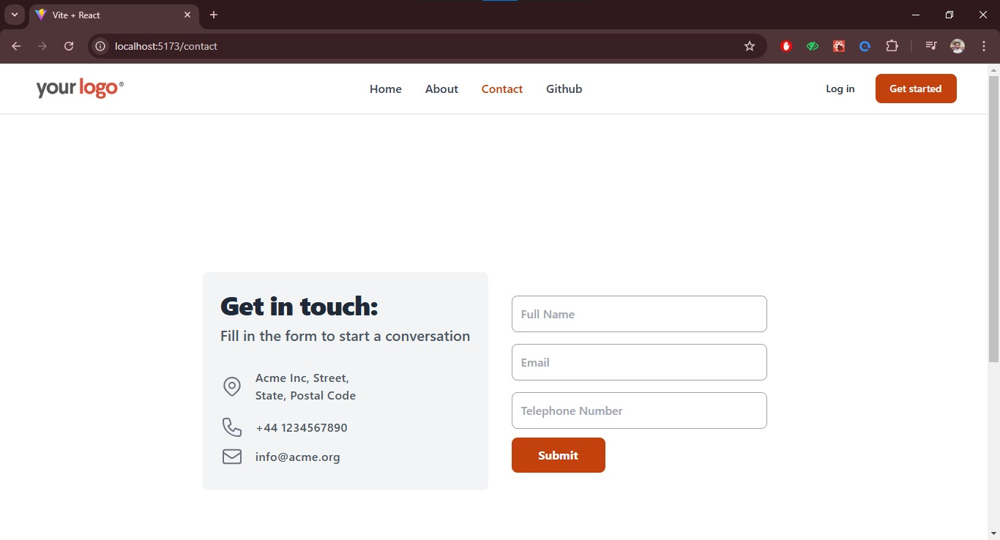

# React Routing Practice Project

This project is a hands-on practice to learn and implement React Routing concepts. The project was completed following the tutorial by **Sir Hitesh Chaudhary**. It focuses on creating a seamless navigation experience using React Router.

## Features

- **Dynamic Routing**: Implemented dynamic routes for user-friendly navigation.
- **Nested Routes**: Demonstrated how to manage nested components.
- **NavLinks**: Used `NavLink` for highlighting the active route.

## Key Learnings

1. **React Router Basics**:
   - Setting up React Router in a project.
   - Using `BrowserRouter`, `Routes`, and `Route` components.

2. **Route Parameters**:
   - Passing parameters through routes.
   - Accessing parameters using the `useParams` hook.

3. **Protected Routes**:
   - Implementing basic route protection.

4. **Lazy Loading**:
   - Optimizing performance by loading components lazily.

## Technologies Used

- **React.js**
- **React Router**
- **JavaScript (ES6)**
- **Tailwind CSS**

## How to Run the Project

1. Clone the repository:

   ```bash
   git clone <repository-url>
   ```

2. Navigate to the project directory:

   ```bash
   cd react-routing-practice
   ```

3. Install dependencies:

   ```bash
   npm install
   ```

4. Start the development server:

   ```bash
   npm start
   ```

5. Open your browser and go to:

   ```
   http://localhost:3000
   ```

## Screenshots

| Home Page                  | About Page                  |
|----------------------------|-----------------------------|
|  |  |

| Contact Page               | Github Page                 |
|----------------------------|-----------------------------|
|  |  |

## Acknowledgements

This project was inspired by the excellent teaching of **Sir Hitesh Chaudhary**. His tutorial provided in-depth knowledge of React Routing and practical examples to follow along.

## License

This project is open-source and available under the [MIT License](./LICENSE).

---

Feel free to reach out for any feedback or improvements! 😄
